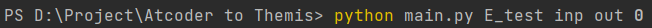
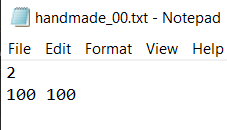
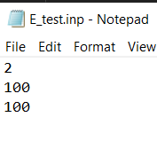
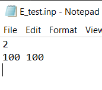

# Testcase Atcoder To Themis

A python file to convert Atcoder testcase to Themis format.

# How to use

1. Download (or Copy) ``main.py`` file.

2. Download Atcoder testcase folder and rename it to ``test``. Note that in ``test``, there is 2 folder ``in`` and ``out``. ``in`` contains all the input files with ``.txt`` extension, ``out`` contains all the output files with ``.txt`` extension. 
Two files having the same name indicate they are the same testcase. 

3. Run ``main.py`` file in command line with 4 additional arguments. 

    Ex: ``python main.py file_name inp out 1``

    ``file_name``: the name of the problem

    ``inp``: Generate ``.inp`` file for input file.

    ``out``: Generate ``.out`` file for output file.

    ``1``: The content in input files are converted into each number is on each line. 
    (if ``0``, then it will copy the whole thing and keep the exact format)

4. The program will generate ``result`` folder contains a folder named ``file_name``. In that folder is the testcases, each testcase corresponds to a folder. Done.

## Somenotes

- Remember to delete the existing ``result`` folder when running the next time, as the program will add more files in and not delete the old existing ones.

# Example

We're at directory ``D:/Projects/Atcoder to Themis``.

Currently, we have these files:

Then, we will run this command to run the ``main.py`` file.

After that we will have a new folder ``result``.

To clarify, ``E_test.inp`` in folder ``000`` is the same as ``test/in/000.txt``.

About the **last** command line argument (``1`` or ``0``):

- If you run with parameter ``1``, the contents in the **input** files will be separated by new line character. (Which means each number is on each separate line).

     

    will become:

    

- If you run with parameter ``0``, nothing will change.
 
     

    will become:

    
