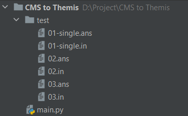
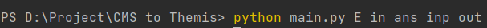
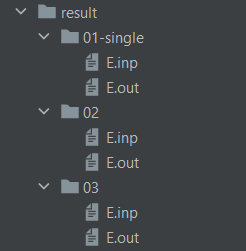

# Testcase CMS to Themis

A python file to convert CMS testcase format to Themis format.

# How to use

1. Download (or Copy) ``main.py`` file.

2. Copy the CMS testcase in, renamed to ``test``. Inside ``test``, there will be all the testcase files, including the input and output files. 
The input and output files have different extension and they are the same name if they are of the same testcase. 
Ex: ``02.in`` and ``02.ans`` are of the same testcase ``02``. ``.in`` is the input extension and ``.ans`` is the output extension.

3. Run ``main.py`` file in command line with $5$ additional arguments. 
Ex: ``python main.py file_name in ans inp out``
``file_name``: the name of the problem.
``in``: the extension of the input files in ``test``.
``ans``: the extension of the output files in ``test``.
``inp``: the extension of the result input files after converting.
``out``: the extension of the result output files after converting.

4. The program will generate ``result`` folder contains a folder named ``file_name``. In that folder is the testcases, each testcase corresponds to a folder. Done.

## Somenotes

- Remember to delete the existing ``result`` folder when running the next time, as the program will add more files in and not delete the old existing ones.

# Example

We're at directory ``D:/Projects/CMS to Themis``.

Currently, we have these files:

Then, we will run this command to run the ``main.py`` file.

After that we will have a new folder ``result``.

To clarify, ``E_test.inp`` in folder ``000`` is the same as ``test/in/000.txt``.