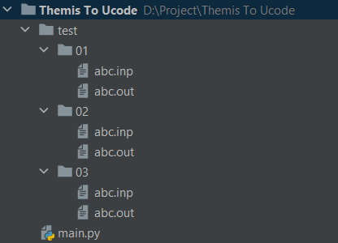
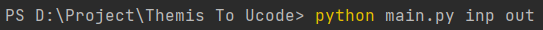
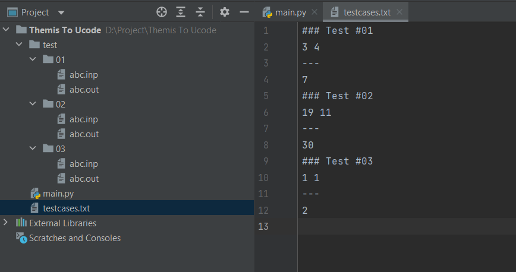

# Testcase-Themis-to-Ucode

A python file to read the testcase of Themis and convert to Ucode (testcases.txt)

# How to use

1. Download (or Copy) ``main.py`` file.

2. Copy the testcase of the problem in Themis format to your current working directory (location of your ``main.py`` file). Rename the folder to ``test``. 
(inside ``test`` there will be multiple testcase folder, each folder contains an INPUT file and an OUTPUT file, usually with ``.inp`` and ``.out`` extension)

3. Run the ``main.py`` file from command line with 2 additional arguments specify the INPUT file extension and the OUTPUT file extension. 

4. The problem will generate a ``testcases.txt`` file (or replace existing one) at your working folder.

## Some notes

* It is assumed that the number of testcases is **smaller than 100**. (In ``testcases.txt`` file you can see the number is indexed 01, 02, ...).
* The filename of INPUT and OUTPUT file can be anything, the program only search for specific file extension. 
* The INPUT extension and OUTPUT extension **must** be different.
* The folder contain the testcases must be named ``test``. (You can change it in ``main.py`` file)

# Example

We're at directory ``D:/Projects/Themis to Ucode``.

In the directory we will have these files:



When we run the ``main.py`` file from command line with ``inp`` and ``out`` arguments at the same directory 
(Depend on the extension you can change: ``inp`` and ``ans``, ``in`` and ``ok``, ...):

```
python main.py inp out
```


There will be a ``testcases.txt`` file generated with Ucode testcase format:



Copy ``testcases.txt`` to where you need to put it. <3
